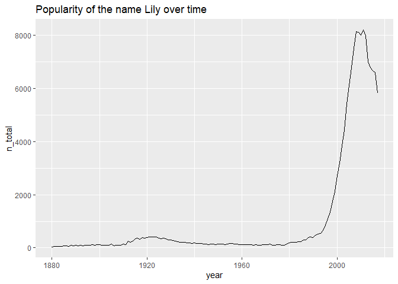
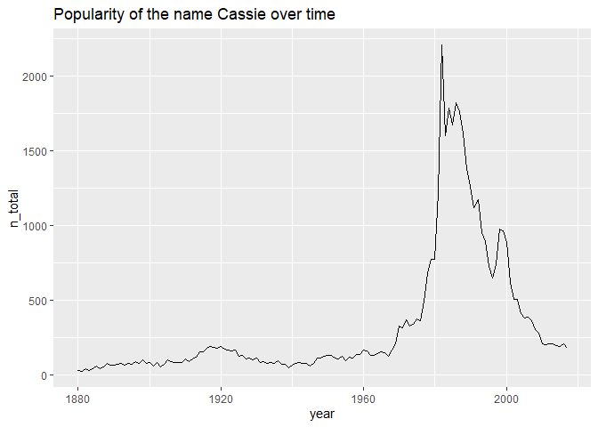
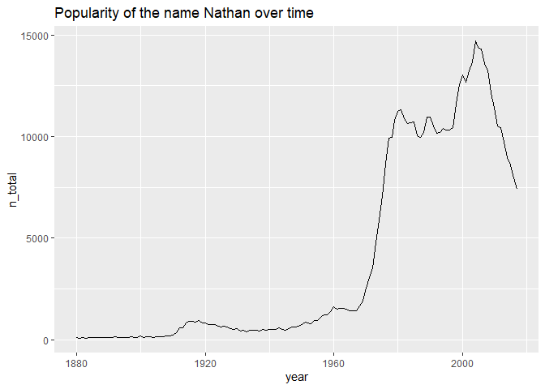
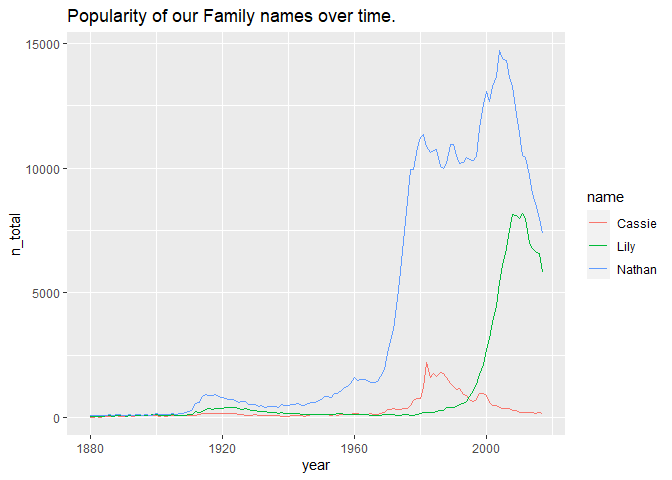
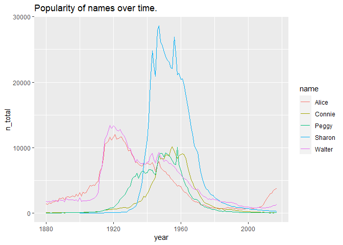
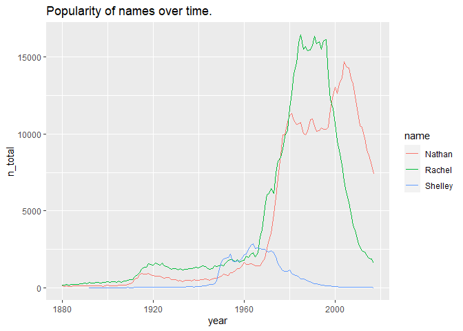
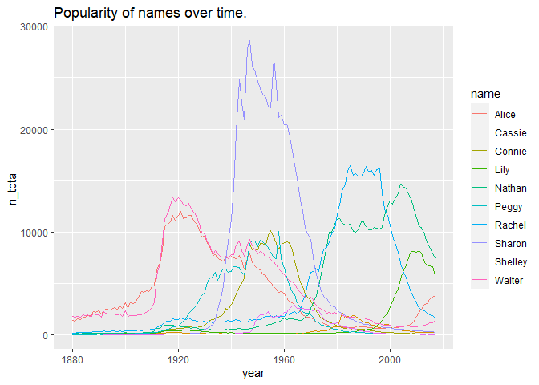
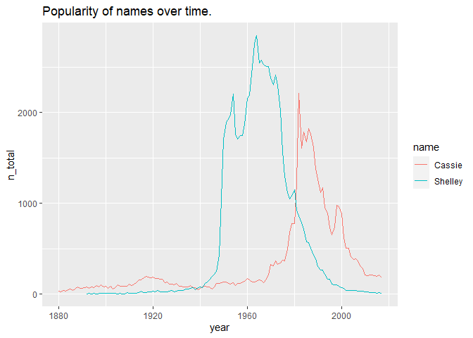

# Family Baby Names

First let's load some packages. 


```r
library(babynames)
library(dplyr)
```

```
## 
## Attaching package: 'dplyr'
```

```
## The following objects are masked from 'package:stats':
## 
##     filter, lag
```

```
## The following objects are masked from 'package:base':
## 
##     intersect, setdiff, setequal, union
```

```r
library(ggplot2)
```

Now, let's take a glimpse at the babynames package.  For more on the `glimpse()` function type `?tibble::glimpse` since dplyr imports the function from the tibble package.

```r
glimpse(babynames)
```

```
## Rows: 1,924,665
## Columns: 5
## $ year <dbl> 1880, 1880, 1880, 1880, 1880, 1880, 1880, 1880, 1880, 1880, 18...
## $ sex  <chr> "F", "F", "F", "F", "F", "F", "F", "F", "F", "F", "F", "F", "F...
## $ name <chr> "Mary", "Anna", "Emma", "Elizabeth", "Minnie", "Margaret", "Id...
## $ n    <int> 7065, 2604, 2003, 1939, 1746, 1578, 1472, 1414, 1320, 1288, 12...
## $ prop <dbl> 0.07238359, 0.02667896, 0.02052149, 0.01986579, 0.01788843, 0....
```

```r
unique(babynames$year)
```

```
##   [1] 1880 1881 1882 1883 1884 1885 1886 1887 1888 1889 1890 1891 1892 1893 1894
##  [16] 1895 1896 1897 1898 1899 1900 1901 1902 1903 1904 1905 1906 1907 1908 1909
##  [31] 1910 1911 1912 1913 1914 1915 1916 1917 1918 1919 1920 1921 1922 1923 1924
##  [46] 1925 1926 1927 1928 1929 1930 1931 1932 1933 1934 1935 1936 1937 1938 1939
##  [61] 1940 1941 1942 1943 1944 1945 1946 1947 1948 1949 1950 1951 1952 1953 1954
##  [76] 1955 1956 1957 1958 1959 1960 1961 1962 1963 1964 1965 1966 1967 1968 1969
##  [91] 1970 1971 1972 1973 1974 1975 1976 1977 1978 1979 1980 1981 1982 1983 1984
## [106] 1985 1986 1987 1988 1989 1990 1991 1992 1993 1994 1995 1996 1997 1998 1999
## [121] 2000 2001 2002 2003 2004 2005 2006 2007 2008 2009 2010 2011 2012 2013 2014
## [136] 2015 2016 2017
```

## Making some plots

Now, I'll make a data frame for each of our names and plot them individually.


```r
babynames_lily <- babynames %>% 
    filter(name == "Lily") %>% 
    group_by(name, year) %>% 
    summarise(n_total = sum(n))

babynames_nathan <- babynames %>% 
    filter(name == "Nathan") %>% 
    group_by(name, year) %>% 
    summarise(n_total = sum(n))

babynames_cassie <- babynames %>% 
    filter(name == "Cassie") %>% 
    group_by(name, year) %>% 
    summarise(n_total = sum(n))

ggplot(babynames_lily, aes(x = year, y = n_total)) +
    geom_line() + 
    ggtitle("Popularity of the name Lily over time")
```

<!-- -->

```r
ggplot(babynames_cassie, aes(x = year, y = n_total)) +
    geom_line() + 
    ggtitle("Popularity of the name Cassie over time")
```

<!-- -->

```r
ggplot(babynames_nathan, aes(x = year, y = n_total)) +
    geom_line() + 
    ggtitle("Popularity of the name Nathan over time")
```

<!-- -->


## Groupings

Now I'll put all of us on the same plot.


```r
babynames_family <- babynames %>% 
    filter(name %in% c("Cassie", "Lily", "Nathan")) %>% 
    group_by(name, year) %>% 
    summarise(n_total = sum(n))

#babynames_family

ggplot(babynames_family, aes(x = year, y = n_total, color = name)) + 
    geom_line() + 
    ggtitle("Popularity of our Family names over time.")
```

<!-- -->


```r
babynames_grandparents <- babynames %>% 
    filter(name %in% c("Sharon", "Peggy", "Walter", "Connie", "Alice")) %>% 
    group_by(name, year) %>% 
    summarise(n_total = sum(n))


ggplot(babynames_grandparents, aes(x = year, y = n_total, color = name)) + 
    geom_line() + 
    ggtitle("Popularity of names over time.")
```

<!-- -->


Now let me compare my siblings and myself.


```r
babynames_siblings <- babynames %>% 
    filter(name %in% c("Nathan", "Shelley", "Rachel")) %>% 
    group_by(name, year) %>% 
    summarise(n_total = sum(n))


ggplot(babynames_siblings, aes(x = year, y = n_total, color = name)) + 
    geom_line() + 
    ggtitle("Popularity of names over time.")
```

<!-- -->


## All together now.

now everybody at once.


```r
babynames_all <- babynames %>% 
    filter(name %in% c("Cassie", "Lily", "Nathan", "Sharon", "Peggy", "Walter", "Connie", "Alice", "Shelley", "Rachel")) %>% 
    group_by(name, year) %>% 
    summarise(n_total = sum(n))


ggplot(babynames_all, aes(x = year, y = n_total, color = name)) + 
    geom_line() + 
    ggtitle("Popularity of names over time.")
```

<!-- -->


## Most Unique


```r
babynames_unique <- babynames %>% 
    filter(name %in% c("Cassie", "Shelley")) %>% 
    group_by(name, year) %>% 
    summarise(n_total = sum(n))


ggplot(babynames_unique, aes(x = year, y = n_total, color = name)) + 
    geom_line() + 
    ggtitle("Popularity of names over time.")
```

<!-- -->

## Other Inquireries

What were the most popular male and female names in our birth years?


```r
## Babynames

mostPopular_byYear <- babynames %>% 
    group_by(year, sex) %>% 
    top_n(1, n)

filter(mostPopular_byYear, year %in% c(1949,1957,1986:1988,1992,2017)) %>% 
    arrange(sex)
```

```
## # A tibble: 14 x 5
## # Groups:   year, sex [14]
##     year sex   name        n    prop
##    <dbl> <chr> <chr>   <int>   <dbl>
##  1  1949 F     Linda   91016 0.0518 
##  2  1957 F     Mary    61092 0.0291 
##  3  1986 F     Jessica 52674 0.0285 
##  4  1987 F     Jessica 55991 0.0299 
##  5  1988 F     Jessica 51538 0.0268 
##  6  1992 F     Ashley  38452 0.0192 
##  7  2017 F     Emma    19738 0.0105 
##  8  1949 M     James   86855 0.0482 
##  9  1957 M     Michael 92695 0.0424 
## 10  1986 M     Michael 64205 0.0334 
## 11  1987 M     Michael 63647 0.0326 
## 12  1988 M     Michael 64133 0.0320 
## 13  1992 M     Michael 54386 0.0259 
## 14  2017 M     Liam    18728 0.00954
```

